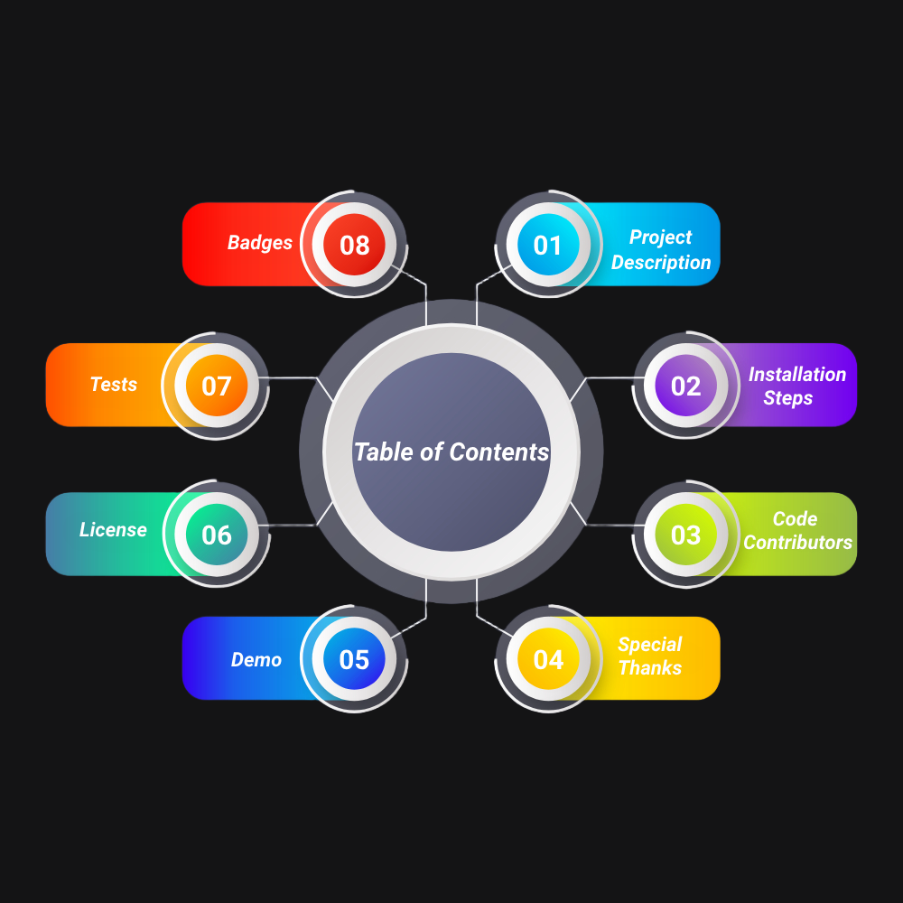

<h1 align="center" style="background-color: white; color: orange; padding: 10px; border-radius: 5px; font-weight: bold; font-family: 'Arial', sans-serif;">
   
  <span style="font-family: 'Helvetica Neue', Helvetica, Arial, sans-serif;">EduPathway</span> 
</h1>


## 🔭 *1. Project Description*
*Edupathway 🎓 is a platform dedicated to supporting SDG 4: Quality Education by providing 100% free, secure, and accessible solutions for students and educational institutions. Our mission is to break financial barriers and ensure that education is truly accessible to everyone. From tuition payments to managing student records and facilitating seamless transactions, Eduthpay eliminates all costs for users, creating a world where education is a right, not a privilege.*

- ### *What Does Edupathway Do?*
*Provides completely free payment solutions to ensure that financial barriers never hinder access to education. Offers a simple and secure way for students to make tuition payments, view payment histories, and receive receipts—all at no cost. Enables educational institutions to efficiently manage student payments and records without any charges. Promotes transparency and ease of use, empowering students and institutions with tools for seamless transactions and effective financial management.*
- ### *Technologies used*
<p align="center"> </a> <a href="https://www.linux.org/" target="_blank" rel="noreferrer">  </a> <a href="https://www.python.org" target="_blank" rel="noreferrer">  </a> <a href="https://www.mysql.com/" target="_blank" rel="noreferrer">  </a> <a href="https://www.nginx.com" target="_blank" rel="noreferrer">  </a> <a href="https://getbootstrap.com" target="_blank" rel="noreferrer">  </a> <a href="https://git-scm.com/" target="_blank" rel="noreferrer">  </a> <a href="https://www.w3schools.com/css/" target="_blank" rel="noreferrer">  </a> <a href="https://www.w3.org/html/" target="_blank" rel="noreferrer">  </a> <a href="https://developer.mozilla.org/en-US/docs/Web/JavaScript" target="_blank" rel="noreferrer">  </a>  </p>


*We used Linux as the operating system for its stability, Python (Flask) for its simplicity in building scalable web applications, and MySQL for efficient data management. Nginx serves as the web server, while Bootstrap, HTML5, CSS3, and JavaScript enable a responsive, dynamic, and interactive front-end experience. Git helps with version control throughout development.*
## 🛠️ *2. Installation Steps*
*⚠️ Ensure that the technologies listed above are installed before proceeding with the installation steps, as it won't work otherwise!*

*1. Clone the repository*

```bash
git clone https://github.com/antoineleno/EduPathway.git
```

*2. Change the working directory*

```bash
cd EduPathway
``` 

*3. Create a virtual environment*

```bash
python3 -m venv myenv
```
*4. Activate the virtual environment*

```bash
source myenv/bin/activate
```

*5. Install dependencies*

```bash
pip install -r requirements/requirements.txt
```
*6. Set up the database*
```bash
sudo mysql -u root -p < requirements/database_setup.sql
```
*7. Set up the trigger for subcription management*
```bash
sudo mysql -u root -p < requirements/subcription.sql
```

*8. Change the working directory and Run the app*

```bash
cd web_flask; python3 app.py
```

🌟 You are all set!


## 📘  *How to use this project*
*After completing the installation steps, an admin, and two students users will be created with the following credentials :*
> - ***email***&nbsp;: *edupathwayadmin@gmail.com*
> - ***password*** : *edupathwaypassword*

> - ***email***&nbsp;: *nouhandoumbouya@gmail.com*
> - ***password*** : *nouhanpassword*

> - ***email***&nbsp;: *alisena@gmail.com*
> - ***password*** : *alisenapassword*

## 👯 *3. Code Contributors*

<p align="center">
  <a href="https://github.com/antoineleno/final_porfolio/graphs/contributors">
    
    
    
    
    
  </a>
</p>

> ### 📫 *How to reach us*
<p align="center">
  Antoine LENO &nbsp;&nbsp;&nbsp;&nbsp; Nouhan DOUMBOUYA &nbsp;&nbsp;&nbsp;&nbsp; Alisena DANISHWER &nbsp;&nbsp;&nbsp;&nbsp; Maria IQBAL &nbsp;&nbsp;&nbsp;&nbsp; MD Rashidul ISLAM<br>
  <a href="mailto:lenoantoine2000@gmail.com">
      
  </a>
  <a href="https://github.com/antoineleno">
      
  </a>
  <a href="https://instagram.com/antoineleno7" target="_blank">
    
  </a>
  &nbsp;&nbsp;&nbsp;&nbsp;&nbsp;&nbsp;
    <a href="mailto:lenoantoine2000@gmail.com">
      
  </a>
  <a href="https://github.com/antoineleno">
      
  </a>
  <a href="https://instagram.com/antoineleno7" target="_blank">
    
  </a>
  &nbsp;&nbsp;&nbsp;&nbsp;&nbsp;&nbsp;
    <a href="mailto:lenoantoine2000@gmail.com">
      
  </a>
  <a href="https://github.com/antoineleno">
      
  </a>
  <a href="https://instagram.com/antoineleno7" target="_blank">
    
  </a>
  &nbsp;&nbsp;&nbsp;&nbsp;&nbsp;&nbsp;
    <a href="mailto:lenoantoine2000@gmail.com">
      
  </a>
  <a href="https://github.com/antoineleno">
      
  </a>
  <a href="https://instagram.com/antoineleno7" target="_blank">
    
  </a>
  &nbsp;&nbsp;&nbsp;&nbsp;&nbsp;&nbsp;
  <a href="mailto:bamadodu634@gmail.com">
    
  </a>
  <a href="https://github.com/Amadou001">
      
  </a>
  <a href="https://instagram.com/amadou4176" target="_blank">
    
  </a>
</p>

## 🙇 *4. Special Thanks to*

- [*ALX Software Engineering*](https://www.alxafrica.com/where-did-the-alx-software-engineering-programme-go/)  *for providing us with an incredible training experience.*
- [*Mastercard Foundation*](https://mastercardfdn.org/)  *for generously funding this transformative training opportunity.*
- [*Holberton Inc*](https://www.holbertonschool.com/)  *for their collaboration in powering this exceptional learning journey.*


## 🚀 *5. Demo*

<p align="center">
  <a href="https://www.youtube.com/watch?v=hPYDavftd8s&list=RDMM7b9z-YcDUrc&index=9" target="blank">
    
  </a>
</p>


## 📜 *6. License*
*Please refer to the included license file in the repository for detailed information.*

## ✅ *7. Tests*
*Run the following command from the root of the project directory to execute all tests and verify the software functionality :*
```bash
python -m unittest discover -v tests
```

## 🏅 *8. Badge*
<p align="center">
  <a href="https://github.com/antoineleno/alx_finale_porfolio/blob/main/LICENSE" target="blank">
    
  </a>
  <a href="https://github.com/antoineleno/alx_finale_porfolio/fork" target="blank">
    
  </a>
  <a href="https://github.com/antoineleno/alx_finale_porfolio/stargazers" target="blank">
    
  </a>
  <a href="https://github.com/antoineleno/alx_finale_porfolio/issues" target="blank">
    
  </a>
  <a href="https://github.com/antoineleno/alx_finale_porfolio/pulls" target="blank">
    
  </a>
  <!-- Example Contribution Badge -->
  <a href="https://github.com/antoineleno/alx_finale_porfolio/graphs/contributors" target="blank">
    
  </a>
</p>


